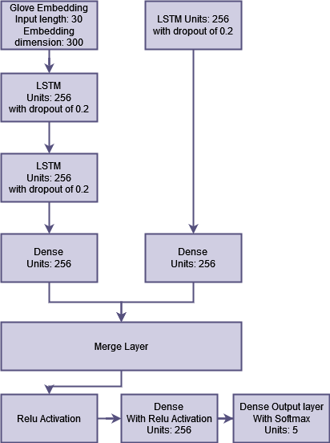

# Project 0D: Sentiment Analysis and Emotion Recognition with ASR.
We use the dataset EmoFilm: https://zenodo.org/record/7665999

## Mel: What challenges does combining acoustic features and word Embedding for emotion recognition pose conceptually and technically?
Located in the combined folder are 3 models:
1. text model
2. acoustic model
3. combined model

The evaluate.py can be ran to see the performance of all 3 models.
The predict.py can be ran to see the confusion matrices of all 3 models.

### Architecture of the combined model:

## Karan: How robust are sentiment analysis/emotion recognition models to variability in language? 
Variable dataset. Show different accuracies on different languages/accents.